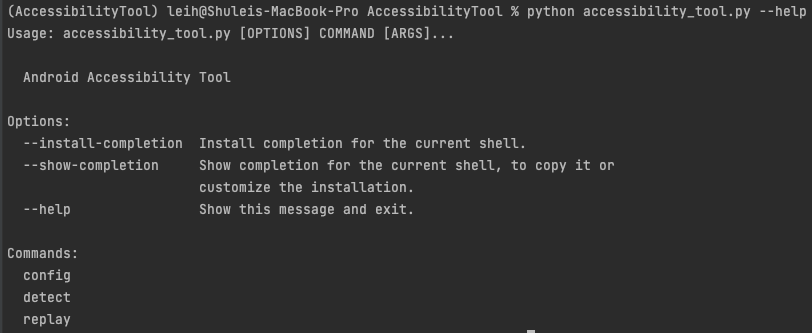
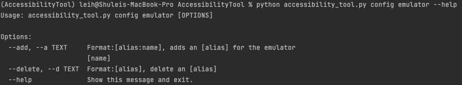
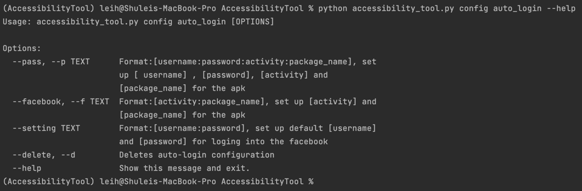
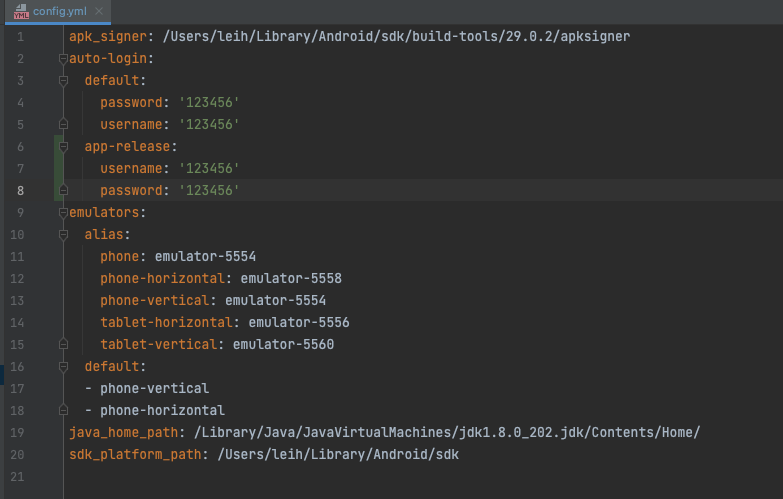

# Accessibility Tool CLI

## Usage



```bash
# help
python accessibility_tool.py --help
```

Three commands are available

- **config**
- **detect**
- **replay**

## Detect Accessibility issues

```bash
# help
python accessibility_tool.py detect --help
# detect
python accessibility_tool.py detect --intput ./input --complete
python accessibility_tool.py detect --device emulator-5554 --xbot
python accessibility_tool.py detect --intput ./input --device emulator-5554 --xbot --uichecker
python accessibility_tool.py detect --d emulator-5554 --d phone-vertical --xbot --uichecker
```


**--input**: the directory where apps are

**--device**: the device to test apps, multiple devices are supported.

- for example, `python accessibility_tool.py detect --device emulator-5554 --device phone-vertical`

**choose a tool to detect**: `--xbot, --uichecker, --deer, --owleye`

**--complete**: use all the tools at one time.

## Edit Configuration


```sh
python accessibility_tool.py config --help
```

**emulator**

- **--add, --a**
- **--delete, --d**

````sh
python accessibility_tool.py config emulator --help
python accessibility_tool.py config emulator add 
````



**auto-login**

- **--add, --a**
- **--delete, --d**



```sh
python accessibility_tool.py config auto-login --help
python accessibility_tool.py config auto-login --add apk-release:123456:123456 
python accessibility_tool.py config auto-login --add apk-release:123456:123456 -add video_app:123456:123456
#remove
python accessibility_tool.py config auto-login --delete testapk
python accessibility_tool.py config auto-login --d apk-release
```

**config/config.yml**

You can manually modify **config.yml**.



## TODO: Replay Accessibility issues

```bash
python accessibility_tool.py replay --help
```

**--video --v** : video file name

**--utg --u**: GUI transition graph in json format depicting the screenshots transitions

**--artifact -a**: screenshots in UTG

# Other Issues

- Hard-coded locations for tapping
- UI Automator used is not compatible with android arm64 architecture
  - currently only for linux_armv7
  - could improve the program to make it compatible with different architecture devices

