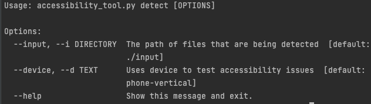

# Accessibility Tool CLI

## Usage


```bash
# help
python accessibility_tool.py --help
```

Three arguments are available

- config
- detect
- replay

## Detect Accessibility issues

```bash
# help
python accessibility_tool.py detect --help

python accessibility_tool.py detect --intput ./input
python accessibility_tool.py detect --device emulator-5554
python accessibility_tool.py detect --intput ./input --device emulator-5554
```



--input: the directory where apps are

--device: the device to test apps(currently only one device **allowed** in the command, but **default devices** can be modified in the **config.yml** and it supports multiple devices )

**TODO**: --output: directory where the results files will be generated

## TODO: Replay Accessibility issues

```bash
python accessibility_tool.py replay --help
```

--video --v : video file name

--utg --u: GUI transition graph in json format depicting the screenshots transitions

--artifact -a: screenshots in UTG

--output -o: output filename

## TBD: Edit Configuration

```bash
python accessibility_tool.py config --help

python accessibility_tool.py config --add java_home_path /Library/Java/JavaVirtualMachines/xxx.xx/Home
```

--add: add an key-value pair to the **config.yml**

**config/config.yml**


# Other Issues

- Hard-coded locations for tapping
- UI Automator used is not compatible with android arm64 architecture
  - currently only for linux_armv7
  - could improve the program to make it compatible with different architecture devices

