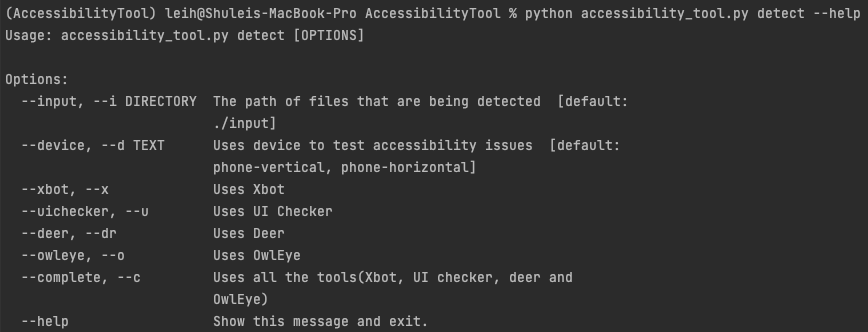
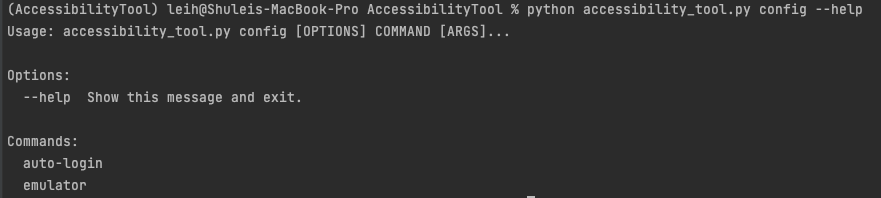

# Android App Usability & Accessibility Testing Tool 
Accessibility Tool is an automated Android testing tool that is integrated multiple modules to report usability and accessibility issues. The main objective is to automatically detect issues of given APKs on multiple devices with multiple device settings.


https://user-images.githubusercontent.com/68264720/219286070-d0cb3874-834a-48c7-be6f-c7936b672f21.mp4


👨🏻‍💻 Following features have been provided by our tool:

- Generating screenshots and transition graphs for testing application.
- Generating accessibility reports for each screen in the application via Google Accessibility Scanner.
- Reporting bug and crash logs.
- Detecting GUI visual defects via Owleyes.

ℹ️ Please check out our wiki page for more information.

## Installations
We have included the full instruction in our Wiki page.

1. Clone the repo into your local machine ✅
2. Set up your local configurations in `config.yml` ✅
3. Install all required packages `conda create --name <env> --file requirement.txt` ✅
4. Set up the emulators ✅
5. Add your APKs into the `./input` folder ✅
6. Start a complete scan with `python accessibility_tool.py detect --d phone-vertical --all` ✅

## Usages
### Help page

```bash
# help
python accessibility_tool.py --help
```


### Issue Detection


```bash
# help
python accessibility_tool.py detect --help

# detection example
python accessibility_tool.py detect --input ./input --all
python accessibility_tool.py detect --device emulator-5554 --all
python accessibility_tool.py detect --input ./input --device emulator-5554 --xbot
python accessibility_tool.py detect --d emulator-5554 --d phone-vertical --xbot
```




**--input**: the directory where apps are

**--device**: the device to test apps, multiple devices are supported.

- for example, `python accessibility_tool.py detect --device emulator-5554 --device phone-vertical`

**choose a tool to detect**: `--xbot, --uichecker, --deer, --owleye`

**--complete**: use all the tools at one time.

## Edit Configuration



```sh
python accessibility_tool.py config --help
```

**emulator**

- **--add, --a**
- **--delete, --d**

````sh
python accessibility_tool.py config emulator --help
python accessibility_tool.py config emulator add 
````


**auto-login**

- **--facebook, --a**
- **--pass, --p**
- **--delete, --d**


```sh
python accessibility_tool.py config auto-login --help
python accessibility_tool.py config auto-login --facebook MainActivity:package_name 
python accessibility_tool.py config auto-login --pass 123456:123456:MainActivity:package_name
python accessibility_tool.py config auto-login --setting 123456:123456 # default username and password for facebook

#remove
python accessibility_tool.py config auto-login --delete
python accessibility_tool.py config auto-login --d
```

**config/config.yml**

You can manually modify **config.yml**.


=======

# Coming Soon 🚀

- Replay bugs on emulators.
- Input generation techniques.
